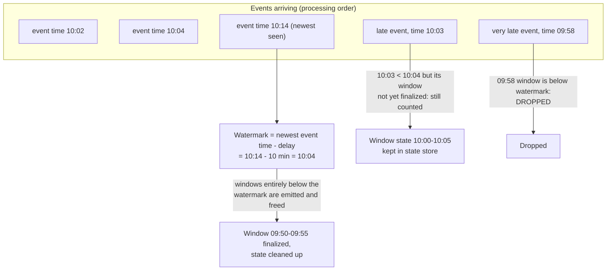
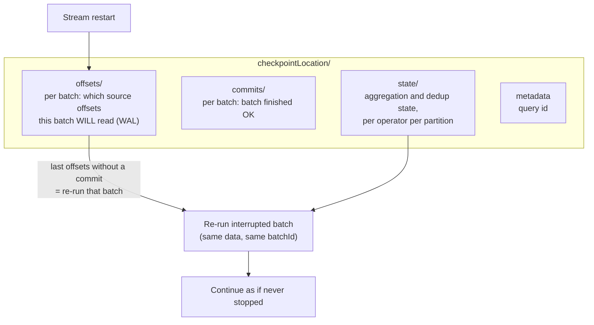

# 13 — Watermarks & Checkpoints

## Why this matters

These are the two hardest streaming ideas and the two most common production failures: state that
grows until OOM (missing/wrong watermark) and streams that can't restart (checkpoint misuse).
They're also a guaranteed senior-interview pair.

## The idea in plain English

**Watermark:** events arrive late — a phone was offline, Kafka lagged. Spark can't wait forever to
finalize a 10:00–10:05 window, or state grows unboundedly. A watermark is a moving promise:
*"I'll accept events up to 10 minutes later than the newest event I've seen; anything older is
dropped and its window is finalized."* It trades a little completeness for bounded memory.

**Checkpoint:** the stream's save file. Which offsets were read, which batches committed, and the
current state — all in cloud storage, so a crashed or redeployed stream resumes exactly where it
left off.

## Diagram — watermark on an event-time timeline



```python
events.withWatermark("event_time", "10 minutes") \
      .groupBy(window("event_time", "5 minutes")) \
      .count()
```

## Diagram — what lives in a checkpoint



## Key takeaways

- Watermark delay is a **business decision**: how late can data be and still matter? Small delay =
  fresher results + less state, but more dropped events. Measure your real lateness distribution
  first.
- The watermark advances with the **max event time seen**, not the wall clock — an idle source
  means the watermark stalls and windows don't finalize.
- In `append` mode a windowed aggregation emits a row **only when the watermark passes the window
  end** — "my stream outputs nothing" is usually just this.
- Checkpoints tie a query to: its source, its query shape, and its state schema. Change those and
  the checkpoint may be invalid — plan schema changes like migrations.
- Watermark + `dropDuplicates` = bounded-memory streaming dedup; without the watermark, the dedup
  key set grows forever.

## Common mistakes

- No watermark on a streaming aggregation — works in every demo, OOMs in production when state
  finally outgrows executors.
- Expecting the watermark to be a hard SLA. It's per-micro-batch and driven by max event time, so
  a few extra late events can slip in or out around the boundary — it's a bound, not a contract.
- Putting the checkpoint on local disk (gone with the cluster) instead of cloud storage.
- Two jobs pointed at one checkpoint (blue/green deploys!) — they corrupt each other's progress.

## Interview angle

*"What is a watermark and why do you need one?"* — bounded state + a rule for late data; give the
formula (max event time − delay) and what happens on both sides of it. *"A streaming job was down
for 2 hours — what happens on restart?"* — checkpoint replay: uncommitted batch re-runs, then the
backlog processes (mention `maxOffsetsPerTrigger` to avoid a giant catch-up batch).

## Related in this repo

- [`05_streaming/04-event-time-and-watermarks.md`](../05_streaming/04-event-time-and-watermarks.md)
- [`05_streaming/03-triggers-modes-checkpoints.md`](../05_streaming/03-triggers-modes-checkpoints.md)
- [`05_streaming/05-stateful-aggregations.md`](../05_streaming/05-stateful-aggregations.md)
- [`05_streaming/diagrams/watermark-progression.mmd`](../05_streaming/diagrams/watermark-progression.mmd)
- [`13_debugging_playbook/04_streaming_checkpoint_issues.md`](../13_debugging_playbook/04_streaming_checkpoint_issues.md)
