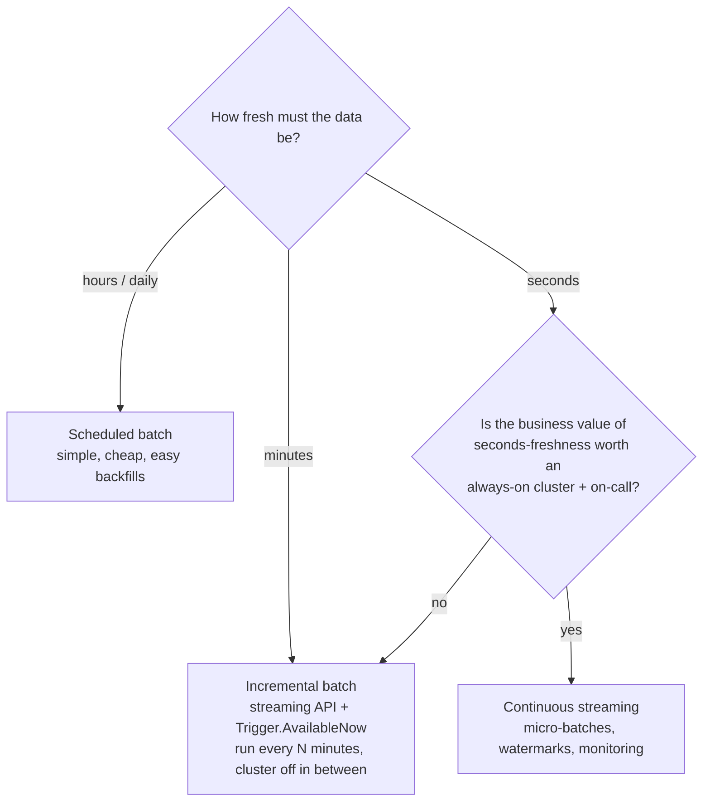
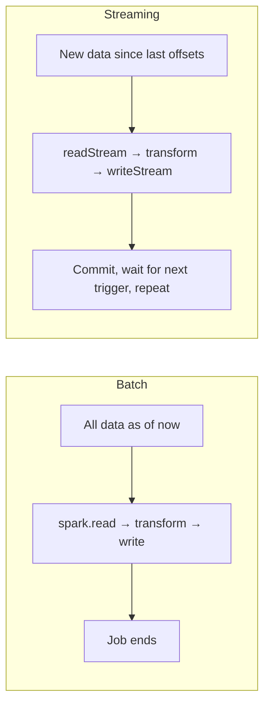

# 14 — Batch vs Streaming

## Why this matters

"Should this pipeline be streaming?" is an architecture decision you'll make (and defend) many
times. Streaming is fashionable and expensive; batch is boring and cheap. Choosing wrong costs
either freshness the business needed or an always-on cluster the business didn't.

## The idea in plain English

Batch processes **bounded** data on a schedule; streaming processes **unbounded** data
continuously. In Spark they share the same DataFrame API and engine, so the real choice is about
**latency requirements vs operational cost** — not about learning a different system. And there's
a middle path most teams should default to: incremental batch / `Trigger.AvailableNow`, which uses
streaming's checkpointing but runs like a scheduled job.

## Diagram — the decision

## Diagram — same engine, different reading pattern

## Side-by-side

| | Batch | Incremental (AvailableNow) | Streaming |
| --- | --- | --- | --- |
| Latency | hours+ | minutes | seconds |
| Cluster | on per run | on per run | always on |
| State to manage | none | checkpoint | checkpoint + state store + watermarks |
| Reprocessing | rerun the job | replay from checkpoint / new checkpoint | hardest — plan carefully |
| Failure surface | small | small | late data, state growth, checkpoint drift |
| Typical use | daily marts, ML training data | hourly bronze/silver loads | fraud signals, live dashboards, CDC fan-out |

## Key takeaways

- **Latency is a requirement, not a virtue.** Ask "what decision changes if this is 5 seconds
  fresh instead of 15 minutes?" — often nothing.
- Incremental batch is the underused sweet spot: exactly-once bookkeeping from Structured
  Streaming, cost profile of batch. On Databricks this is Auto Loader + `Trigger.AvailableNow`.
- Streaming code and batch code can be the same function applied to a different reader — design
  transformations as pure DataFrame-in → DataFrame-out and you can switch modes later
  (this is how [`06_real_projects/`](../06_real_projects/) structures jobs).
- A streaming pipeline is a *service*: it needs monitoring, alerting, an on-call story, and a
  backlog-recovery plan. Budget for that, not just the cluster.

## Common mistakes

- Building streaming because the source is Kafka. Kafka is happily consumed in incremental batches.
- Building daily batch on data the business genuinely reacts to in minutes (inventory,
  fraud) — then bolting on "mini-batches every 2 minutes" with homemade bookkeeping that
  Structured Streaming would have given you for free.
- Forgetting backfills: batch reruns are trivial; streaming reprocessing needs a plan *designed
  in* (replayable source retention, rebuild-from-bronze).
- Comparing costs naively: a 24/7 small cluster often costs more than a big cluster 30 min/day.

## Interview angle

An architecture-round staple: *"Design the pipeline — batch or streaming?"* Strong answers start
with the freshness requirement and the consumer, name the incremental-batch middle option
(instant senior signal), and mention operational cost. Weak answers start with technology.

## Related in this repo

- [`05_streaming/01-the-model.md`](../05_streaming/01-the-model.md) — one API, two modes
- [`05_streaming/03-triggers-modes-checkpoints.md`](../05_streaming/03-triggers-modes-checkpoints.md) — `AvailableNow` and friends
- [`15_databricks_production/03_autoloader_and_lakeflow.md`](../15_databricks_production/03_autoloader_and_lakeflow.md)
- [`10_architecture/02_architect_tradeoff_checklist.md`](../10_architecture/02_architect_tradeoff_checklist.md)
