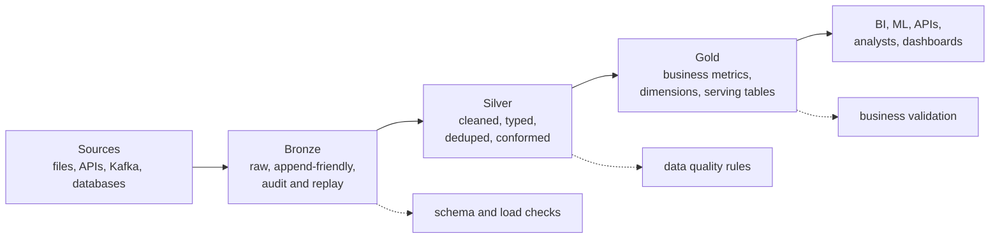

# 14 - Medallion Architecture

## Why it matters

Medallion architecture gives production pipelines a shared language: raw data, cleaned data, and
business-ready data. Without it, teams mix ingestion, cleanup, and serving logic in the same place.

## Plain English explanation

Bronze stores raw or lightly validated data. Silver cleans, types, deduplicates, and conforms it.
Gold contains business-ready aggregates, dimensions, and serving tables. The layers make replay,
debugging, and ownership easier.

## Mermaid diagram

## Key takeaways

- Bronze preserves history and replay ability.
- Silver is where correctness and standardization usually happen.
- Gold is optimized for consumers, not for raw ingestion.
- Data quality should appear at every layer with different rules.

## Common mistakes

- Treating Bronze as a dumping ground with no metadata.
- Putting business aggregates in Silver.
- Letting Gold tables depend directly on raw sources.
- Creating too many layers for a small project.

## Interview angle

Explain the layers by responsibility and failure recovery: Bronze lets you replay, Silver makes data
trustworthy, Gold makes it useful to the business.

## Related repo folders/files

- [`06_real_projects/01-medallion-architecture.md`](../06_real_projects/01-medallion-architecture.md)
- [`06_real_projects/orders-etl/`](../06_real_projects/orders-etl/)
- [`06_real_projects/clickstream-stream/`](../06_real_projects/clickstream-stream/)
- [`assets/animations/medallion_animation.html`](../assets/animations/medallion_animation.html)
