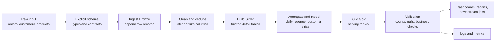

# 15 - End-to-End ETL

## Why it matters

Real Spark work is not one transformation in a notebook. It is a repeatable pipeline with inputs,
schemas, transformations, table writes, validations, logs, and a recovery story.

## Plain English explanation

An ETL job reads raw data, applies explicit schemas, writes Bronze, cleans and deduplicates into
Silver, builds Gold outputs, validates the result, and records enough information to rerun safely.

## Mermaid diagram

## Key takeaways

- Explicit schemas make failures earlier and clearer.
- Bronze/Silver/Gold separates replay, correctness, and serving concerns.
- ETL should be idempotent: rerunning the same input should not duplicate output.
- Validation is part of the pipeline, not a separate afterthought.

## Common mistakes

- Trusting schema inference in production jobs.
- Writing only final output and losing raw replay.
- Mixing cleaning and business aggregation in one unreadable step.
- Not testing reruns.

## Interview angle

For a portfolio project, narrate the pipeline in order: source, schema, Bronze, Silver, Gold,
validation, failure mode, and how you would deploy it.

## Related repo folders/files

- [`06_real_projects/orders-etl/README.md`](../06_real_projects/orders-etl/README.md)
- [`06_real_projects/orders-etl/src/orders_etl/jobs/01_ingest_bronze.py`](../06_real_projects/orders-etl/src/orders_etl/jobs/01_ingest_bronze.py)
- [`06_real_projects/orders-etl/src/orders_etl/jobs/02_build_silver.py`](../06_real_projects/orders-etl/src/orders_etl/jobs/02_build_silver.py)
- [`06_real_projects/orders-etl/src/orders_etl/jobs/03_build_gold.py`](../06_real_projects/orders-etl/src/orders_etl/jobs/03_build_gold.py)
