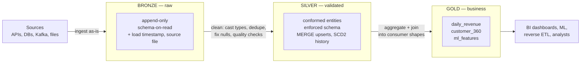
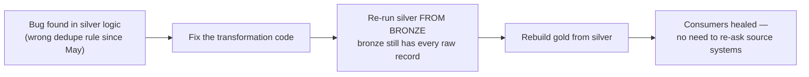

# 15 — Medallion Architecture

## Why this matters

Medallion (bronze/silver/gold) is the default way lakehouse pipelines are organized — you will see
it at nearly every Databricks shop and be asked about it in nearly every data engineering
interview. Its real value isn't the color names: it's that **each layer has one job**, so bugs are
findable, backfills are possible, and teams can consume at the right level of trust.

## The idea in plain English

Data gets more trustworthy left to right:

- **Bronze — keep everything.** Raw data as it arrived, append-only, minimal changes (add
  ingestion metadata). Its job: never lose source data; make replay possible.
- **Silver — make it usable.** Cleaned, typed, deduplicated, conformed entities ("customers",
  "orders"). Its job: one trustworthy version of each entity.
- **Gold — make it answer questions.** Aggregates and marts shaped for a specific consumer
  (dashboard, ML features, finance report). Its job: fast, business-ready answers.

## Diagram — the flow and each layer's contract

## Diagram — why replay works

This replay property is the strongest argument for bronze. Source systems purge, APIs
rate-limit, Kafka retention expires — your bronze layer is the durable copy.

## Key takeaways

- **Rules are per-layer, not per-pipeline:** bronze never edits, silver never aggregates for a
  specific consumer, gold never reaches back to raw sources.
- Quality gates live at the bronze→silver boundary: invalid rows are quarantined (not dropped
  silently) — see [`06_real_projects/dq-framework/`](../06_real_projects/dq-framework/).
- Each hop is idempotent (MERGE by key, or overwrite-by-partition) so re-runs are safe —
  see [`06_real_projects/02-idempotency-patterns.md`](../06_real_projects/02-idempotency-patterns.md).
- Medallion says nothing about batch vs streaming — the same layers work with Auto Loader +
  streaming hops (that's Lakeflow/DLT's model too).
- Three is a guideline, not a law: some teams add a landing zone before bronze or split silver;
  what matters is that each layer's contract stays single-purpose.

## Common mistakes

- "Cleaning just a little" in bronze (dropping bad rows, fixing types) — the replay guarantee
  dies, because bronze no longer equals the source.
- Building gold straight from bronze "temporarily" — every consumer now re-implements silver's
  cleaning, differently.
- One giant gold table for everyone instead of small purpose-built marts.
- No retention/compaction strategy on bronze: it's append-only forever, so plan OPTIMIZE and
  storage-tier policies from day one.

## Interview angle

*"Explain medallion architecture"* — don't recite colors; state each layer's **contract** and the
replay story, then give one concrete table per layer (raw_orders → orders → daily_revenue).
Follow-up: *"Where do data quality checks go and what happens to failing rows?"* (bronze→silver
gate, quarantine table, alert — never silent drops).

## Related in this repo

- [`06_real_projects/01-medallion-architecture.md`](../06_real_projects/01-medallion-architecture.md)
- [`06_real_projects/orders-etl/`](../06_real_projects/orders-etl/) — a working three-layer pipeline
- [`06_real_projects/03-data-quality-patterns.md`](../06_real_projects/03-data-quality-patterns.md)
- Next page: [16 — End-to-end ETL project](./16_end_to_end_etl_project.md)
