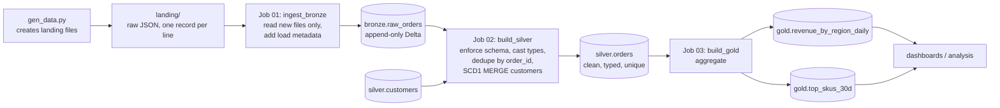
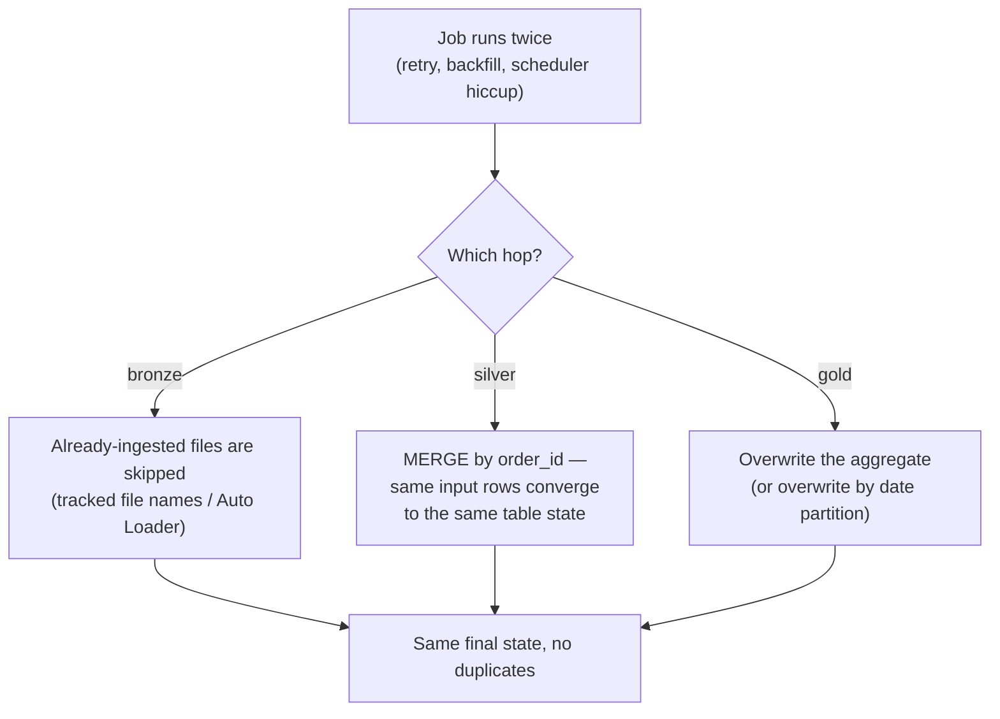

# 16 — End-to-End ETL Project (orders-etl)

## Why this matters

Every concept in this repo comes together in one runnable system:
[`06_real_projects/orders-etl/`](../06_real_projects/orders-etl/). If you can explain this diagram
end to end — including what happens when a job re-runs or bad data arrives — you can explain a
real production pipeline in an interview. This page is the system view; the project README is the
build guide.

## The idea in plain English

JSON order dumps land in a folder. Three jobs move them through the medallion layers: ingest
raw files into bronze (idempotently), clean and dedupe into silver (with an SCD1 customer merge),
and aggregate into gold marts. Every job can be re-run safely, and every table is Delta, so each
hop is atomic.

## Diagram — the whole system

## Diagram — what makes each hop safe to re-run

Idempotency is the difference between "pipeline" and "time bomb". The three patterns above —
skip-processed-input, MERGE-by-key, overwrite-by-partition — cover almost every real job.

## Key takeaways

- The **structure** teaches as much as the code: config separated from logic
  (`config.py`), explicit schemas (`schemas.py`), one job = one file = one responsibility,
  pure DataFrame-in/DataFrame-out functions that are unit-testable.
- Failure containment: a bad landing file breaks bronze→silver *validation*, not the whole
  pipeline — quarantine and continue, don't crash and lose the night's load.
- The same design scales up unchanged: landing/ becomes cloud storage + Auto Loader, jobs become
  Databricks Workflow tasks, tables get registered in Unity Catalog
  ([page 18](./18_databricks_production_workflow.md)).
- Run it, then **open the Spark UI** and find: the shuffle in the dedupe, the MERGE's join, the
  file counts per layer.

## Common mistakes

- Writing the whole pipeline as one script with one giant chain — impossible to re-run one layer
  or test one transformation.
- Reading `landing/` with blind `spark.read.json` every run — full re-ingestion, duplicates in
  bronze, cost growing with history.
- Aggregating gold from *all* of silver every day instead of overwriting only affected date
  partitions once data is large.
- No process tracking: when someone asks "did last night's load run?", the answer shouldn't be
  "let me grep the logs."

## Interview angle

"Walk me through a pipeline you've built" — this project is a complete, honest answer: source
format, layer contracts, idempotency per hop, failure handling, and what you'd change at 100×
scale (incremental gold, Auto Loader, orchestration). Practice narrating the first diagram out
loud in under 3 minutes.

## Related in this repo

- [`06_real_projects/orders-etl/README.md`](../06_real_projects/orders-etl/README.md) — build and run it
- [`06_real_projects/02-idempotency-patterns.md`](../06_real_projects/02-idempotency-patterns.md)
- [`06_real_projects/03-data-quality-patterns.md`](../06_real_projects/03-data-quality-patterns.md)
- [`06_real_projects/04-scd-types.md`](../06_real_projects/04-scd-types.md) — the customer MERGE, upgraded to SCD2
- [15 — Medallion architecture](./15_medallion_architecture.md) — the pattern this implements
