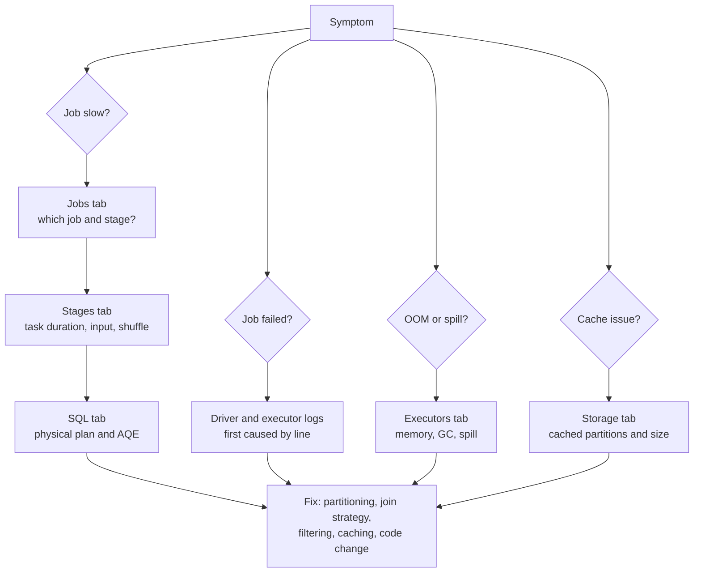
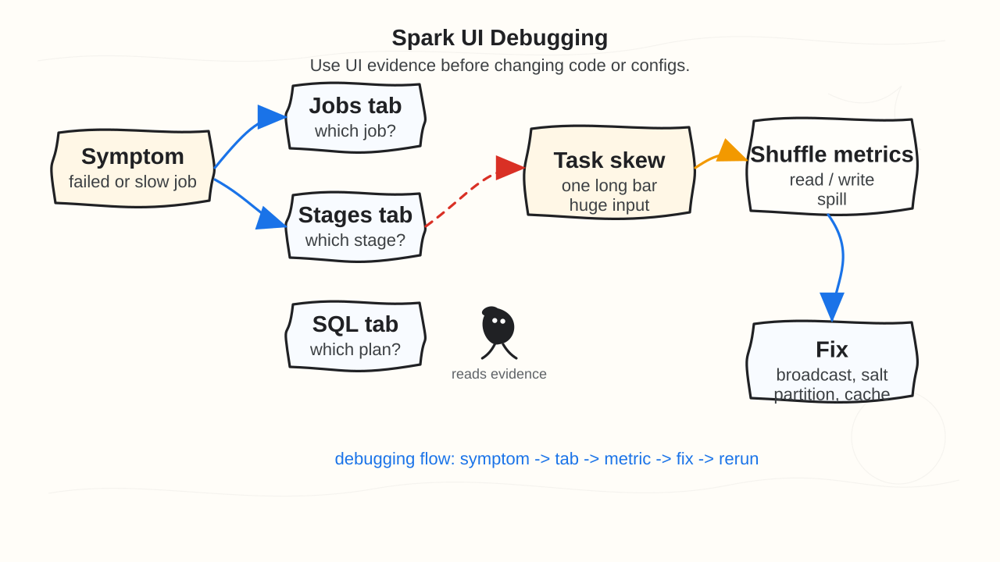

# 16 - Spark UI Debugging

## Why it matters

The Spark UI turns "Spark is slow" into evidence. It shows jobs, stages, tasks, SQL plans, storage,
executors, shuffle, spills, and failures.

## Plain English explanation

Start with the symptom. If a query is slow, check Jobs and SQL. If one stage is slow, check task
duration and shuffle read. If memory is bad, check spill and executor metrics. If cached data is
wrong or missing, check Storage.

## Mermaid diagram

## Visual asset

Open animation: [Spark UI Debugging Flow Animation](../assets/animations/spark_ui_debugging_flow.html)

Plain English: start from the symptom, open the tab that has evidence, identify the metric that
looks wrong, fix the cause, then rerun and compare.

Common interview question: "A Spark job is slow and one task runs much longer than the rest. What
do you check in the Spark UI?"

Debugging angle: do not start with random configs. Use Jobs, Stages, SQL, Executors, and logs to
prove whether the issue is skew, shuffle, memory spill, bad join strategy, or source I/O.

## Key takeaways

- Use the UI to narrow the problem before changing configs.
- Stages reveal shuffle boundaries.
- Task distribution reveals skew.
- SQL plans reveal join strategy and AQE decisions.
- Executor metrics reveal memory pressure and spill.

## Common mistakes

- Tuning blindly from a stack trace.
- Looking at total job time without checking the slowest task.
- Ignoring the SQL tab for DataFrame jobs.
- Forgetting the UI disappears when the driver exits locally.

## Interview angle

For troubleshooting questions, answer as a workflow: symptom, UI tab, metric, likely cause, fix,
and verification step. This is stronger than naming random Spark configs.

## Related repo folders/files

- [`14_spark_ui_lab/README.md`](../14_spark_ui_lab/README.md)
- [`14_spark_ui_lab/01_jobs_stages_tasks.md`](../14_spark_ui_lab/01_jobs_stages_tasks.md)
- [`03_optimization/11-spark-ui-tour.md`](../03_optimization/11-spark-ui-tour.md)
- [`13_debugging_playbook/`](../13_debugging_playbook/)
- [`assets/animations/spark_ui_debugging_flow.html`](../assets/animations/spark_ui_debugging_flow.html)
