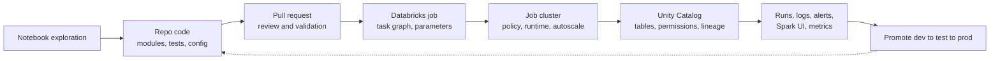

# 17 - Databricks Production Workflow

## Why it matters

Databricks makes Spark easier to operate, but production still needs code review, cluster policy,
permissions, jobs, monitoring, and rollback. A notebook alone is not production.

## Plain English explanation

Prototype in notebooks only long enough to learn. Move reusable logic into repo code. Configure job
clusters, parameters, secrets, Unity Catalog permissions, and schedules. Monitor runs and promote
through environments with version control.

## Mermaid diagram

## Key takeaways

- Use job clusters for repeatable scheduled work.
- Keep business logic in versioned code, not only notebook cells.
- Unity Catalog controls data access and lineage.
- Cluster policies prevent expensive or unsafe runtime choices.
- Monitoring must include data quality, not just job success.

## Common mistakes

- Manually running notebooks as "production".
- Giving broad workspace permissions instead of table-level controls.
- Using all-purpose clusters for every scheduled job.
- Missing idempotency in retries.

## Interview angle

Describe production as a workflow: repo, CI, job definition, job cluster, secrets, Unity Catalog,
monitoring, alerts, and rollback. Mention the difference between exploration notebooks and
scheduled jobs.

## Related repo folders/files

- [`15_databricks_production/README.md`](../15_databricks_production/README.md)
- [`15_databricks_production/01_workspace_jobs_clusters.md`](../15_databricks_production/01_workspace_jobs_clusters.md)
- [`15_databricks_production/02_unity_catalog_security.md`](../15_databricks_production/02_unity_catalog_security.md)
- [`15_databricks_production/03_autoloader_and_lakeflow.md`](../15_databricks_production/03_autoloader_and_lakeflow.md)
