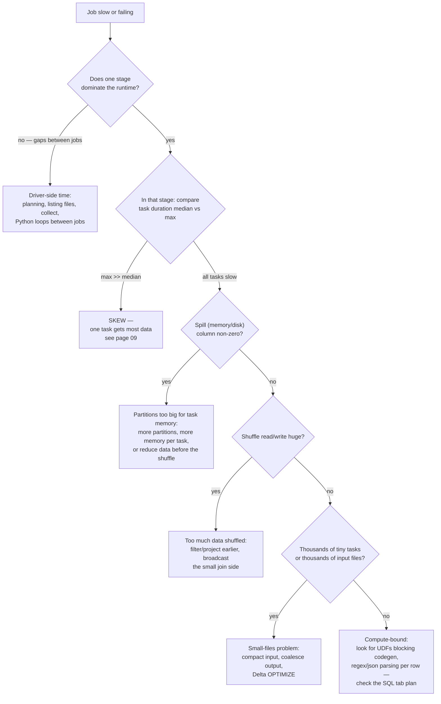
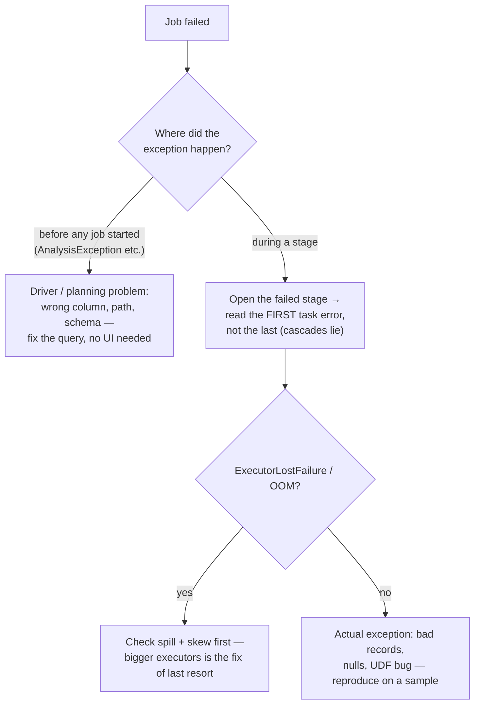

# 17 — Spark UI Troubleshooting Map

## Why this matters

The Spark UI is the only place Spark tells you the truth. Logs say *that* something failed; the UI
shows *why* — which stage, which task, how much shuffle, how much spill, which join strategy. This
page is a symptom-first map: start from what you observe, follow the tree to the tab and metric
that confirms it.

## The idea in plain English

Almost every "Spark problem" is one of five roots: **skew**, **spill/memory**, **too much
shuffle**, **too many small files/tasks**, or a **slow/blocked driver**. Each leaves a distinct
fingerprint in a specific UI tab. Diagnose by fingerprint, don't guess by feel.

## Diagram — symptom to root cause

## Which tab answers which question

| Question | Tab | Look at |
| --- | --- | --- |
| Which job/stage is slow? | Jobs → Stages | duration, task count per stage |
| Is it skew? | Stages → a stage → Summary metrics | min / median / max task duration and shuffle read |
| Is it spilling? | Stages → task table | "Spill (Memory)" / "Spill (Disk)" columns |
| What join strategy ran? Did AQE act? | SQL / DataFrame | physical plan: `BroadcastHashJoin` vs `SortMergeJoin`, `AQEShuffleRead` |
| Is cache working? | Storage | fraction cached, memory vs disk |
| Are executors dying / GC-bound? | Executors | dead executors, GC time vs task time, per-executor shuffle |
| What config actually applied? | Environment | `spark.sql.*` effective values |

## Diagram — failed job triage

## Key takeaways

- **Always median vs max**, never averages — skew hides in averages.
- Read failures from the **first** error in the first failed task; later errors are usually
  cascade noise.
- The SQL tab is the most underused tab: it shows the real (post-AQE) plan with per-operator rows
  and timing — the fastest way to see a wrong join strategy or a missing filter pushdown.
- Local reflex to build: run an example from this repo, open <http://localhost:4040>, and find the
  stage boundary you predicted from the code. That habit is the whole
  [`14_spark_ui_lab/`](../14_spark_ui_lab/).

## Common mistakes

- Jumping straight to "increase executor memory" — it hides spill for a while and doubles cost;
  the root cause (skew, partition sizing, unfiltered shuffle) remains.
- Debugging from logs alone when the UI would show the answer in one screenshot.
- Forgetting the UI dies with the application — use the history server (or Databricks' persisted
  Spark UI) for post-mortems.
- Tuning configs found on Stack Overflow without confirming the fingerprint in the UI first.

## Interview angle

Troubleshooting scenarios are the core of senior interviews, and they all reduce to this page:
*"A job that took 20 minutes now takes 3 hours — walk me through your process."* Narrate the
decision tree: isolate the stage → task distribution → spill → shuffle volume → plan in the SQL
tab. Naming the exact tabs and metrics is what makes the answer credible.

## Related in this repo

- [`14_spark_ui_lab/01_jobs_stages_tasks.md`](../14_spark_ui_lab/01_jobs_stages_tasks.md)
- [`03_optimization/11-spark-ui-tour.md`](../03_optimization/11-spark-ui-tour.md) and
  [`12-debugging-failures.md`](../03_optimization/12-debugging-failures.md)
- [`13_debugging_playbook/`](../13_debugging_playbook/) — full playbooks per failure class
- [`07_interview_prep/04-troubleshooting-scenarios.md`](../07_interview_prep/04-troubleshooting-scenarios.md)
