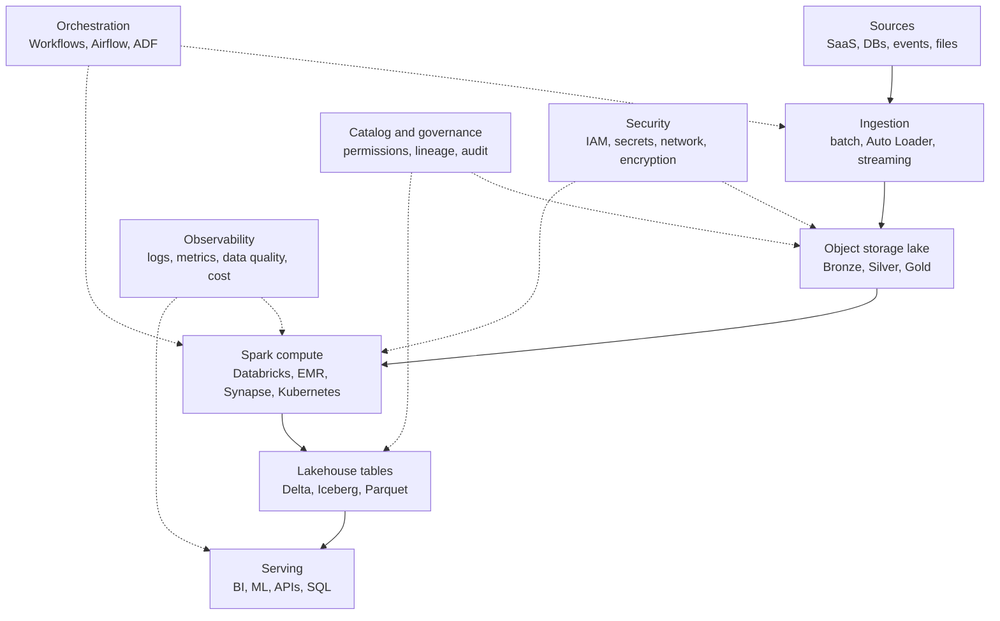

# 18 - Cloud Lakehouse Architecture

## Why it matters

Senior Spark work is platform work: storage layout, security, cost, orchestration, observability,
governance, recovery, and serving patterns. Spark is one engine inside a larger lakehouse.

## Plain English explanation

A cloud lakehouse stores data in object storage, processes it with Spark, governs it with catalog
and IAM controls, orchestrates jobs, validates quality, and serves data to BI, ML, APIs, and
analysts.

## Mermaid diagram

## Key takeaways

- Object storage is the durable data layer.
- Spark compute should be replaceable and policy-controlled.
- Catalog, IAM, and lineage are architecture concerns, not admin details.
- Cost and observability must be designed from the start.
- Serving patterns influence table layout.

## Common mistakes

- Drawing only data flow and ignoring security and operations.
- Using one bucket/container for every environment without clear isolation.
- Optimizing compute without fixing file layout.
- Designing Gold tables without knowing consumers.

## Interview angle

For architect-level questions, state requirements first, then draw storage, compute, governance,
orchestration, observability, and serving. Explain tradeoffs: cost, latency, isolation, recovery,
and ownership.

## Related repo folders/files

- [`10_architecture/01_lakehouse_system_designs.md`](../10_architecture/01_lakehouse_system_designs.md)
- [`10_architecture/02_architect_tradeoff_checklist.md`](../10_architecture/02_architect_tradeoff_checklist.md)
- [`16_cloud_lakehouse/01_cloud_lakehouse_design.md`](../16_cloud_lakehouse/01_cloud_lakehouse_design.md)
- [`16_cloud_lakehouse/02_cost_and_governance.md`](../16_cloud_lakehouse/02_cost_and_governance.md)
