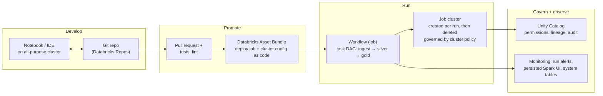
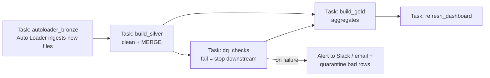

# 18 — Databricks Production Workflow

## Why this matters

Most professional Spark today runs on Databricks. The gap between "I can write PySpark" and "I can
ship on Databricks" is not Spark knowledge — it's the platform workflow: how code moves from a
notebook to a scheduled, governed, monitored job. This is exactly what "production experience"
means in job descriptions.

## The idea in plain English

Development happens in notebooks or an IDE, synced to git. Code ships as a **Workflow (job)**: a
DAG of tasks running on a **job cluster** that spins up, runs, and dies (cheap), not the
always-on all-purpose cluster you develop on (expensive). Every table access goes through
**Unity Catalog**, which is one permission + lineage + audit layer across all workspaces. CI/CD
(Databricks Asset Bundles) promotes the same code dev → staging → prod.

## Diagram — from idea to scheduled production job

## Diagram — a typical production workflow (task DAG)

## The pieces and what they replace

| Databricks piece | What it is | Ad-hoc equivalent it replaces |
| --- | --- | --- |
| All-purpose cluster | shared, long-lived dev compute | your laptop's `local[*]` |
| Job cluster | per-run, right-sized, auto-terminating | cron + hand-managed cluster |
| Workflows | task DAG with retries, alerts, schedules/triggers | Airflow for simple cases |
| Auto Loader | incremental file ingestion with checkpointed state | "list the folder and diff it" scripts |
| Unity Catalog | central ACLs, lineage, audit across workspaces | per-bucket IAM chaos |
| Asset Bundles (DABs) | jobs/clusters/code as reviewable YAML + CI deploy | clicking the UI in prod |

## Key takeaways

- **Job clusters, not all-purpose clusters, for anything scheduled.** It's the single biggest cost
  lever; cluster policies enforce it.
- Everything is code: job definitions, cluster specs, permissions. If it was configured by
  clicking, it can't be reviewed, promoted, or restored.
- Unity Catalog's three-level namespace (`catalog.schema.table`) is the governance unit — grants,
  lineage, and audit hang off it, which is why prod tables never live in `hive_metastore`.
- A failing DQ task should **block downstream tasks** — encode quality gates into the DAG, not
  into hope.
- Databricks persists the Spark UI for finished job runs — everything from
  [page 17](./17_spark_ui_troubleshooting.md) works on production post-mortems.

## Common mistakes

- Scheduling notebooks against an all-purpose cluster — 3–5× the cost, shared-state surprises.
- `%run`-chains and copy-pasted notebook cells instead of a repo with modules and tests.
- One user's personal token running production jobs (they leave; jobs die) — use service
  principals.
- Hardcoding paths (`/mnt/prod/...`) instead of parameterizing by environment through bundle
  targets — dev runs against prod data eventually.

## Interview angle

*"How do you deploy a Spark pipeline to production on Databricks?"* — narrate the first diagram:
repo → PR with tests → asset bundle deploy → workflow on a job cluster → UC permissions →
monitoring and alerts. Mention job vs all-purpose cluster cost and service principals: those two
details separate "used Databricks" from "ran Databricks in production".

## Related in this repo

- [`15_databricks_production/01_workspace_jobs_clusters.md`](../15_databricks_production/01_workspace_jobs_clusters.md)
- [`15_databricks_production/02_unity_catalog_security.md`](../15_databricks_production/02_unity_catalog_security.md)
- [`15_databricks_production/03_autoloader_and_lakeflow.md`](../15_databricks_production/03_autoloader_and_lakeflow.md)
- [`06_real_projects/05-deployment-patterns.md`](../06_real_projects/05-deployment-patterns.md)
- [`13_debugging_playbook/05_databricks_failures.md`](../13_debugging_playbook/05_databricks_failures.md)
