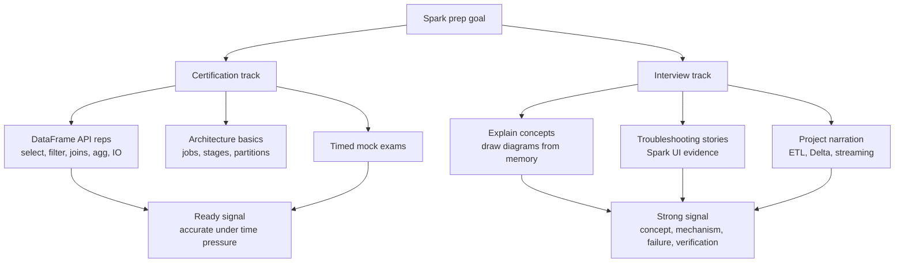

# 19 - Certification Roadmap

## Why it matters

Certification and interviews reward different preparation. The exam needs API breadth and accurate
details. Interviews need explanation, debugging judgment, and project stories.

## Plain English explanation

Use `02_pyspark_core` for exam repetition, diagrams 02-13 for mental models, real projects for
portfolio stories, and the debugging playbooks for senior scenario answers.

## Mermaid diagram

## Key takeaways

- The Databricks Associate exam is heavily DataFrame API oriented.
- Interview prep should include drawing and explaining architecture.
- Senior answers need diagnosis and verification, not just fixes.
- One project you can explain deeply beats many shallow projects.

## Common mistakes

- Preparing only flashcards and never running code.
- Studying architecture deeply but neglecting API syntax for the exam.
- Giving config changes before diagnosing a scenario.
- Failing to explain a project end to end.

## Interview angle

Use a four-part answer format: concept, mechanism, failure mode, and how you verify it in the Spark
UI or logs. That structure works for junior definitions and senior incident questions.

## Related repo folders/files

- [`07_interview_prep/README.md`](../07_interview_prep/README.md)
- [`07_interview_prep/mock_exam_1.md`](../07_interview_prep/mock_exam_1.md)
- [`07_interview_prep/mock_exam_2.md`](../07_interview_prep/mock_exam_2.md)
- [`INTERVIEW_BANK.md`](../INTERVIEW_BANK.md)
- [`12_certification_prep/README.md`](../12_certification_prep/README.md)
