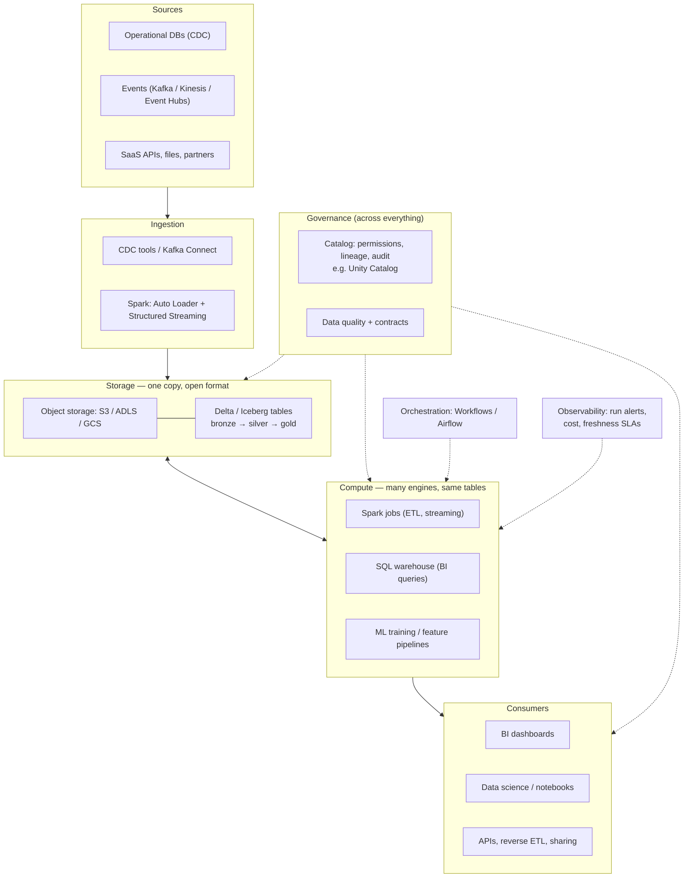
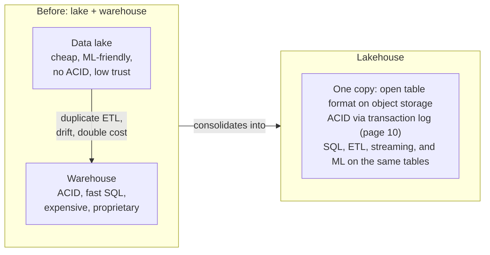

# 19 — Cloud Lakehouse Architecture

## Why this matters

This is the architect-level view: how Spark, Delta, and Databricks-style compute fit into a whole
cloud platform, with governance, orchestration, and consumers around them. System-design
interviews for senior data roles are essentially "draw this diagram and defend each box".

## The idea in plain English

The lakehouse bet is simple: **store everything once, in open formats, on cheap object storage;
bring different compute engines to that one copy.** Storage and compute scale (and bill)
independently. A governance layer sits across everything so one set of permissions and lineage
covers ETL, SQL, BI, and ML. Around the core: orchestration triggers work, observability watches
it, and consumers read from serving layers.

## Diagram — the layered platform

## Diagram — why lakehouse (the two-copy problem it kills)

## Cloud mapping cheat sheet

| Layer | AWS | Azure | GCP |
| --- | --- | --- | --- |
| Object storage | S3 | ADLS Gen2 | GCS |
| Streaming ingest | Kinesis / MSK | Event Hubs | Pub/Sub |
| Spark compute | Databricks / EMR / Glue | Databricks / Synapse / Fabric | Databricks / Dataproc |
| BI SQL | Databricks SQL / Athena / Redshift | Databricks SQL / Fabric | Databricks SQL / BigQuery |
| Orchestration | Workflows / MWAA / Step Functions | Workflows / ADF | Workflows / Composer |

The architecture is cloud-agnostic; only the box labels change — which is precisely the argument
for open table formats.

## Key takeaways

- **Separation of storage and compute** is the economic foundation: storage is pennies, compute is
  dollars, and idle compute can be zero.
- The catalog/governance layer is what makes "one copy" safe — without central permissions and
  lineage, the lakehouse is just a data swamp with better file formats.
- Design for **egress of trust, not egress of data**: consumers read governed gold tables (or
  Delta Sharing), not copies emailed around.
- Cost levers, in order: right-size and auto-terminate compute, incremental instead of full
  recompute, file compaction, then storage tiering —
  [`16_cloud_lakehouse/02_cost_and_governance.md`](../16_cloud_lakehouse/02_cost_and_governance.md).
- DR is mostly a storage problem: replicate buckets + metadata; compute is recreated from code
  (which is why everything-as-code matters, [page 18](./18_databricks_production_workflow.md)).

## Common mistakes

- Rebuilding the two-copy world *inside* the lakehouse: exporting gold tables into a separate
  warehouse "for BI" out of habit.
- Governance as an afterthought — retrofitting permissions and lineage onto hundreds of tables is
  a year-long project; starting with a catalog is a day.
- One giant cluster for everything instead of per-workload compute (ETL jobs vs BI warehouse vs
  ML), which is the whole point of separated compute.
- Ignoring data contracts at the edges: the platform is only as reliable as the schemas sources
  promise.

## Interview angle

The system-design prompt: *"Design an analytics platform for a company with operational DBs,
clickstream, and ML needs."* Draw the layered diagram, then defend: why object storage + open
format (cost, no lock-in, multi-engine), why a central catalog (governance), where streaming vs
batch fits ([page 14](./14_batch_vs_streaming.md)), and how you'd control cost. Trade-off talk
beats technology name-dropping.

## Related in this repo

- [`16_cloud_lakehouse/01_cloud_lakehouse_design.md`](../16_cloud_lakehouse/01_cloud_lakehouse_design.md)
- [`16_cloud_lakehouse/02_cost_and_governance.md`](../16_cloud_lakehouse/02_cost_and_governance.md)
- [`10_architecture/01_lakehouse_system_designs.md`](../10_architecture/01_lakehouse_system_designs.md)
- [`10_architecture/02_architect_tradeoff_checklist.md`](../10_architecture/02_architect_tradeoff_checklist.md)
- [`04_delta_lake/09-format-comparison.md`](../04_delta_lake/09-format-comparison.md) — Delta vs Iceberg vs Hudi
