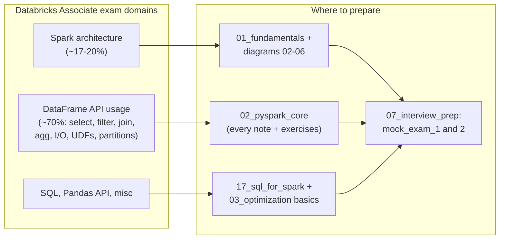
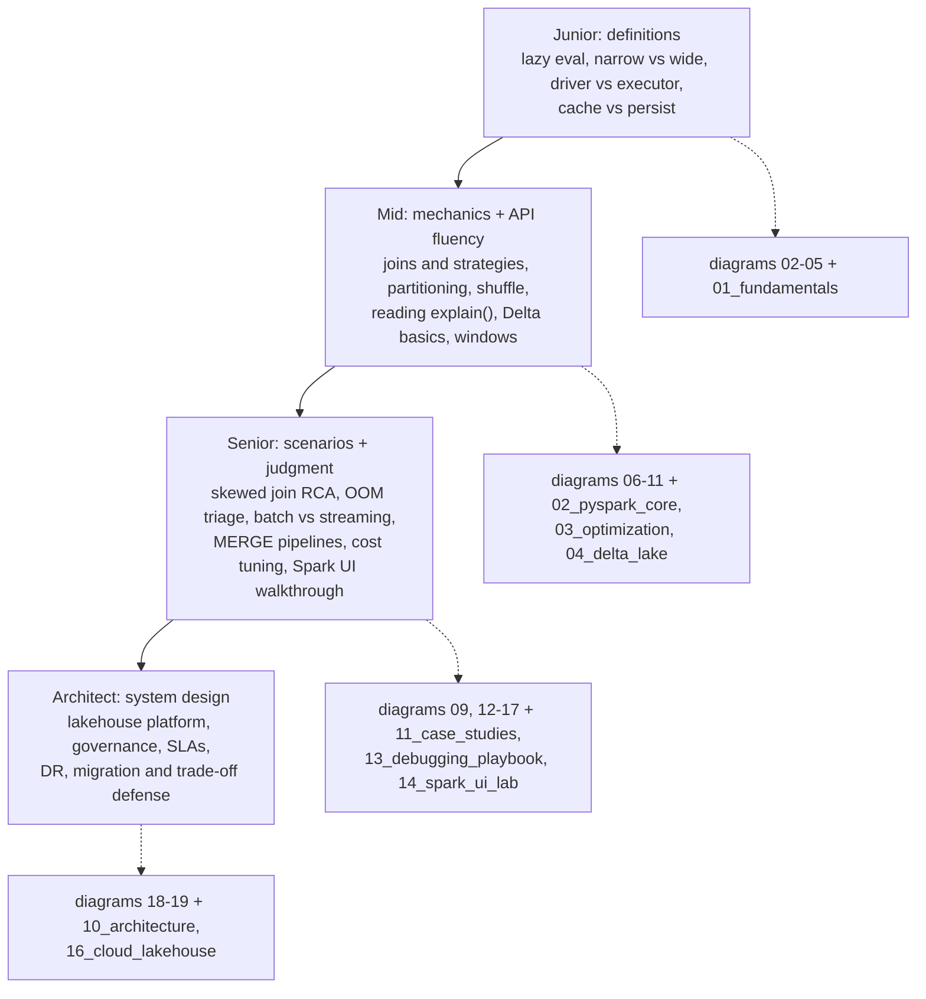

# 20 — Certification & Interview Map

## Why this matters

Studying "everything about Spark" is unbounded; studying **what gets asked** is a few weeks of
focused work. This page maps the Databricks Associate exam domains and the interview-question
ladder onto the exact repo folders that prepare you for each — so prep becomes navigation, not
guesswork.

## The idea in plain English

Two different games, one codebase. The **certification** tests breadth of API knowledge and
architecture basics — it's won with reps in `02_pyspark_core` and mock exams. **Interviews** test
depth and judgment — they're won with the diagrams in this folder, the troubleshooting playbooks,
and one project you can narrate end to end.

## Diagram — exam domains → repo folders

## Diagram — the interview ladder

## The eight questions you will definitely get

| Question | Your answer lives in |
| --- | --- |
| Explain Spark architecture | [02](./02_spark_architecture.md) + [03](./03_driver_executor_flow.md) |
| Why is Spark lazy? What's a stage? | [04](./04_lazy_evaluation_and_dag.md) |
| Narrow vs wide? repartition vs coalesce? | [05](./05_narrow_vs_wide_transformations.md) + [06](./06_partitioning_and_shuffle.md) |
| How does Spark choose a join? | [08](./08_join_strategies.md) |
| One task takes forever — what do you do? | [09](./09_skew_and_broadcast_join.md) + [17](./17_spark_ui_troubleshooting.md) |
| How does Delta give ACID on object storage? | [10](./10_delta_lake_architecture.md) |
| Exactly-once streaming — how? | [12](./12_streaming_pipeline.md) + [13](./13_watermark_checkpoint_flow.md) |
| Design a data platform | [15](./15_medallion_architecture.md) + [19](./19_cloud_lakehouse_architecture.md) |

## Key takeaways

- For the cert: it's ~70% DataFrame API. Grind
  [`02_pyspark_core/`](../02_pyspark_core/) exercises until syntax is automatic, then take
  [`mock_exam_1`](../07_interview_prep/mock_exam_1.md) and
  [`mock_exam_2`](../07_interview_prep/mock_exam_2.md) under time pressure.
- For interviews: every senior question is a **story** — symptom, diagnosis (name the UI metric),
  fix, and what you changed so it never recurs. The case studies in
  [`11_case_studies/`](../11_case_studies/) are pre-built stories.
- Redrawing these diagrams from memory is the highest-yield revision technique in the repo
  (Feynman method — [`LEARNING_STRATEGY.md`](../LEARNING_STRATEGY.md)).
- One project narrated fluently ([page 16](./16_end_to_end_etl_project.md)) beats five projects
  listed on a resume.

## Common mistakes

- Memorizing answers without running code — interviewers probe one level deeper than any script.
- Prepping architecture questions for an exam that mostly tests API syntax (or vice versa).
- Answering scenario questions with configs before diagnosis — always describe *how you'd confirm*
  the cause first.
- Skipping the "what would you do differently" ending — that reflection is what senior sounds like.

## Interview angle

This whole page *is* the interview angle. Meta-tip: when asked anything, structure the answer as
**concept → mechanism → failure mode → how you'd verify in the UI**. That four-beat pattern works
from junior definitions to architect trade-offs, and it's the same why/how/when/failure philosophy
this repo is built on.

## Related in this repo

- [`07_interview_prep/`](../07_interview_prep/) — question banks, cheatsheet, pitfalls, cert overview
- [`12_certification_prep/`](../12_certification_prep/) — study workflow
- [`INTERVIEW_BANK.md`](../INTERVIEW_BANK.md) — structured answers by level
- [`ROADMAP.md`](../ROADMAP.md) Level 10
