# Hand-Drawn SVG Gallery

Actual SVG explainers for Spark concepts. These are standalone 16:9 files under `assets/illustrations/handdrawn/` and can be embedded directly in GitHub Markdown.

## Spark architecture

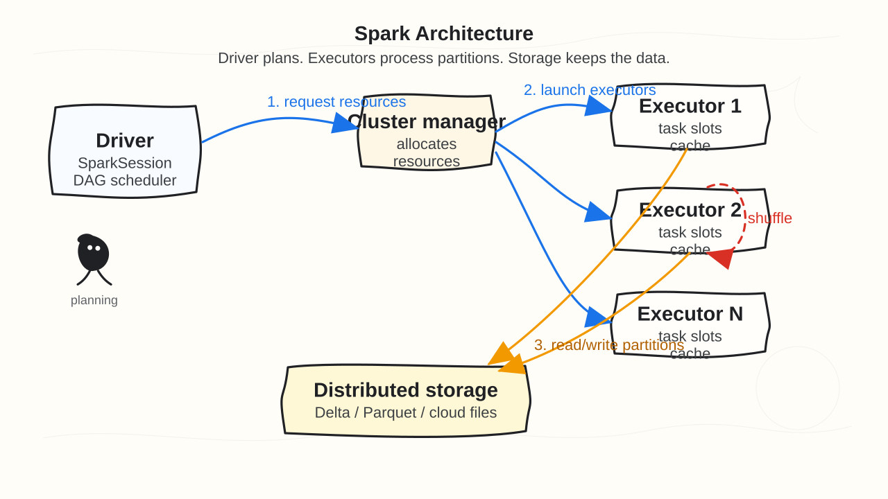

## Lazy evaluation DAG

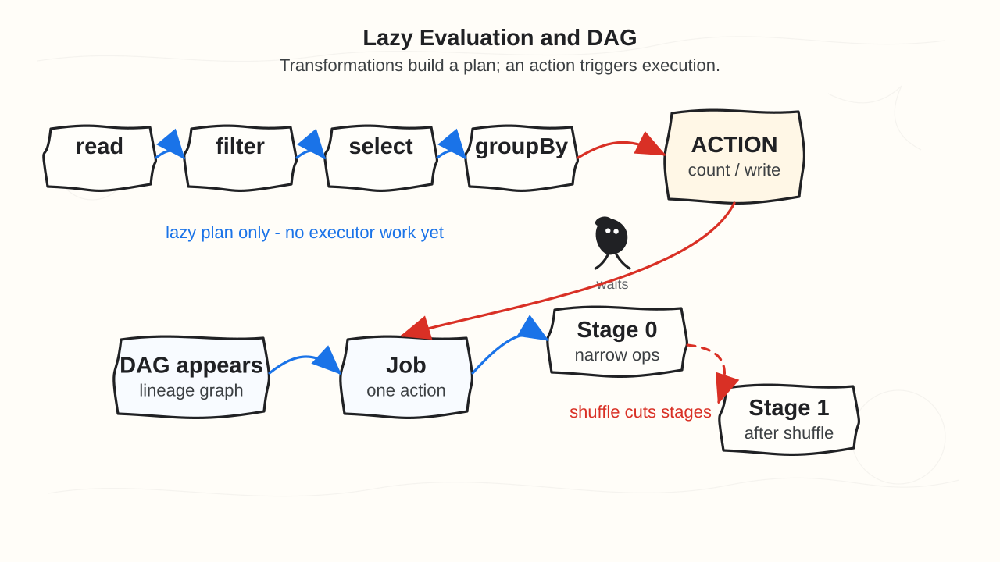

## DAG, jobs, stages, tasks

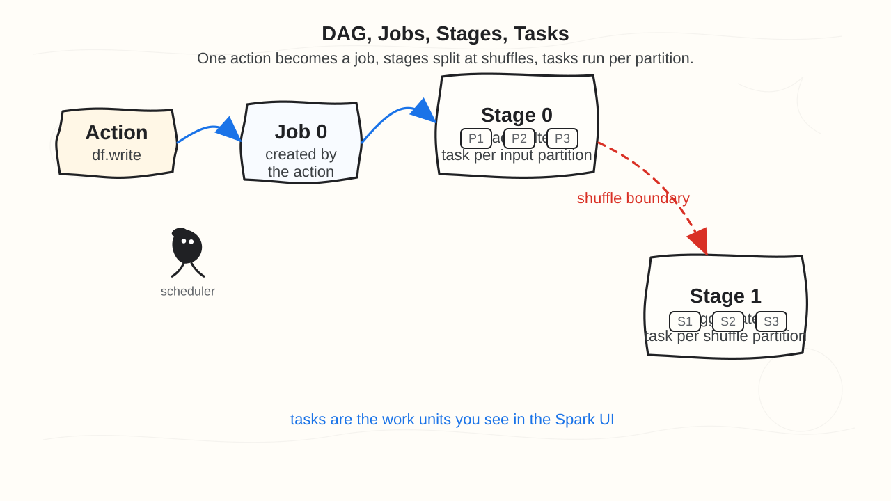

## Narrow vs wide transformations

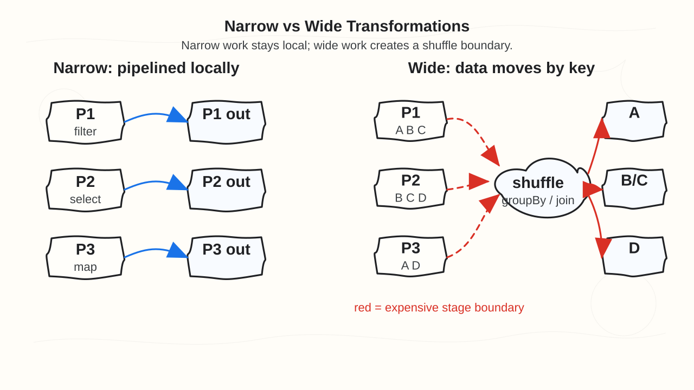

## Partitioning and shuffle

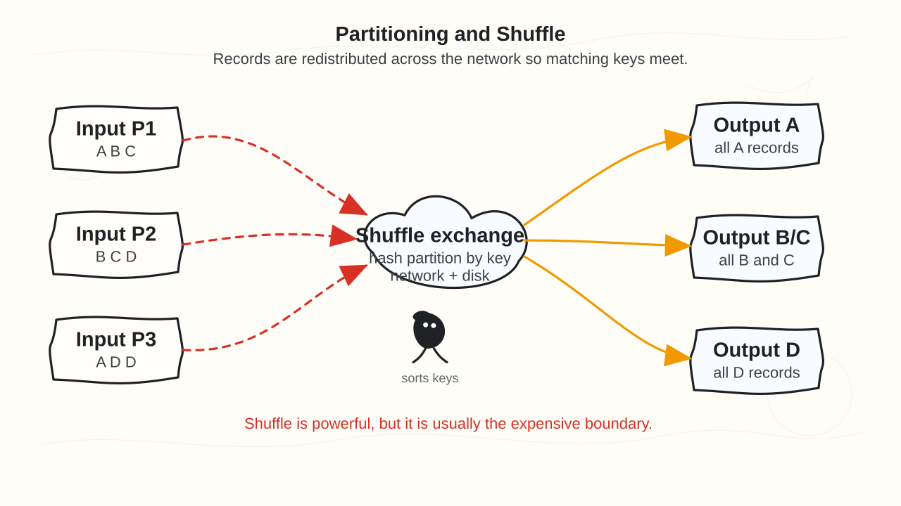

## Join strategies

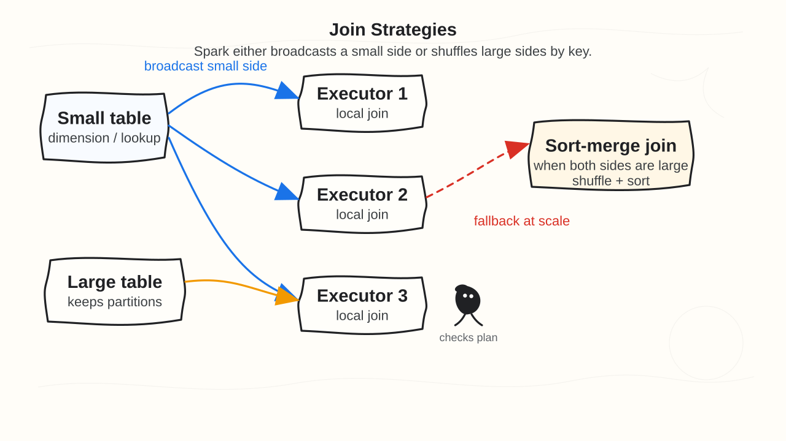

## Skew and broadcast join

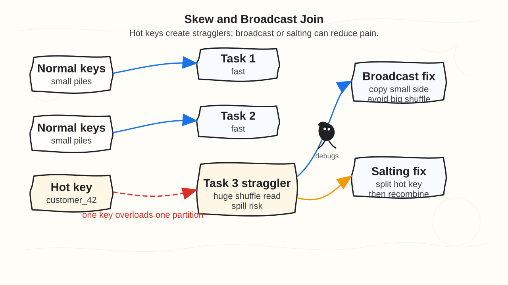

## Catalyst, Tungsten, AQE

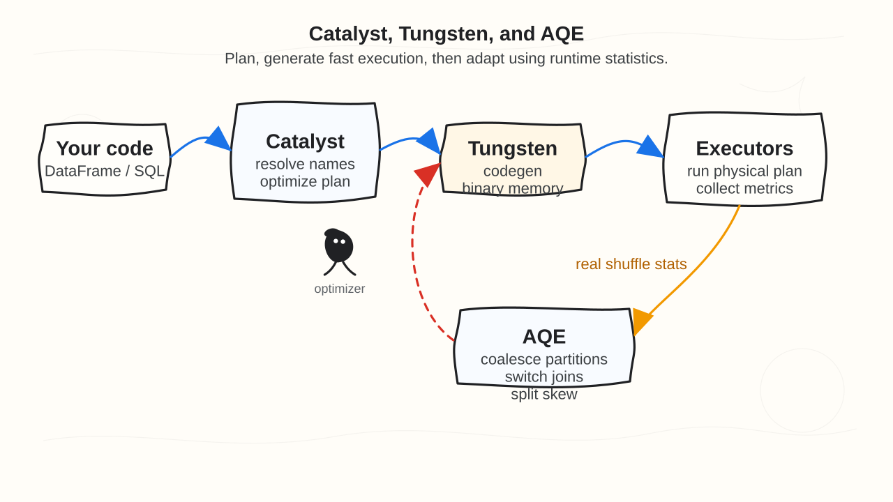

## Delta Lake architecture

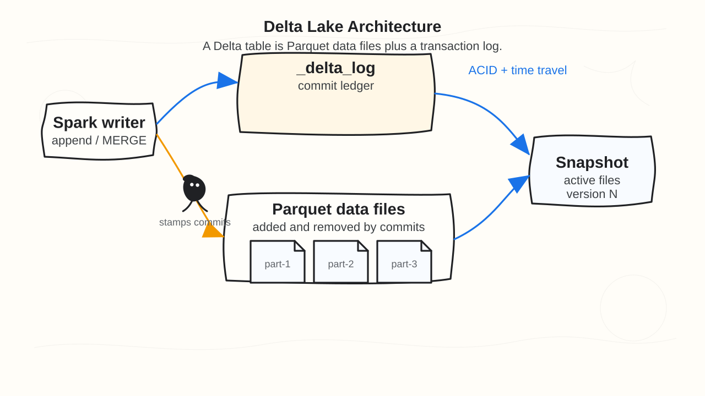

## Structured Streaming

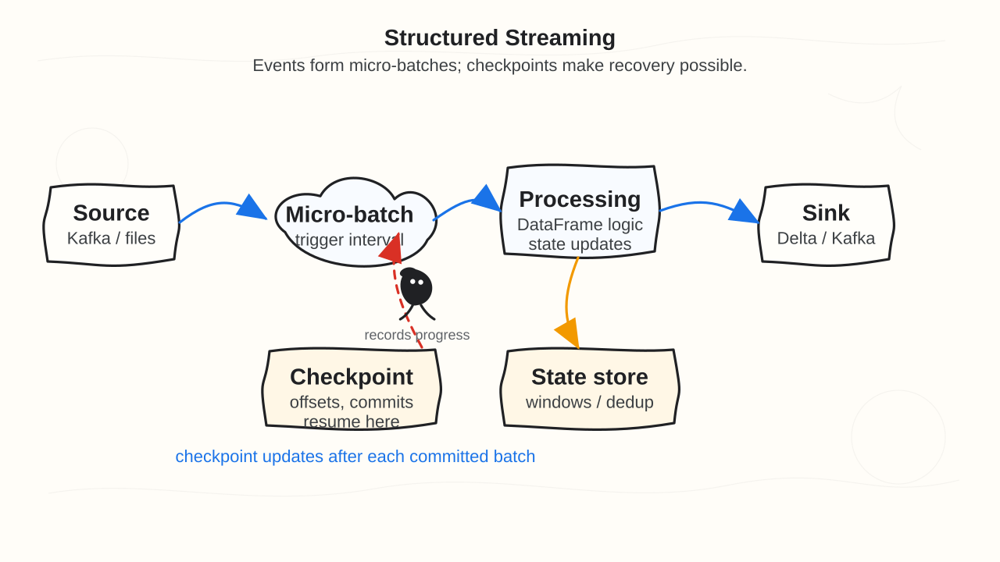

## Medallion architecture

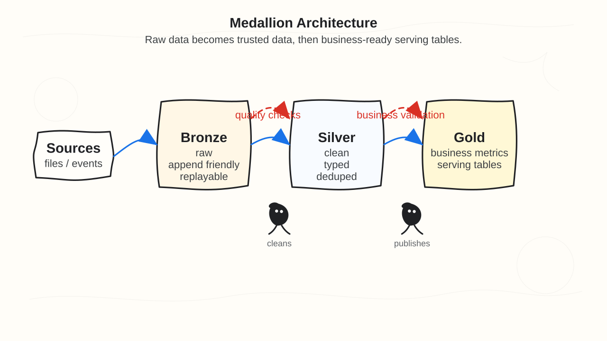

## Spark UI debugging

## Databricks production workflow

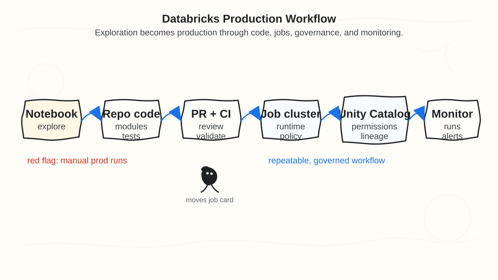

## Cloud lakehouse architecture

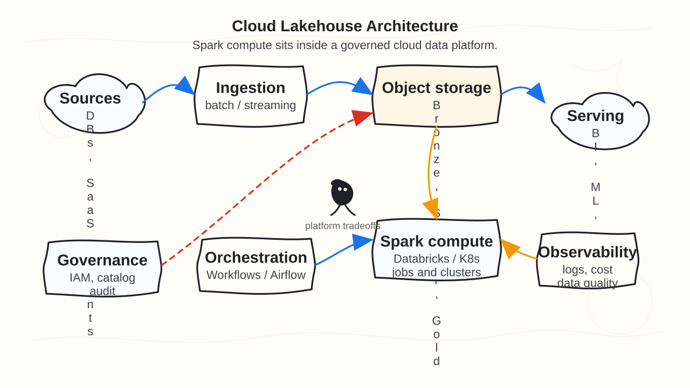
